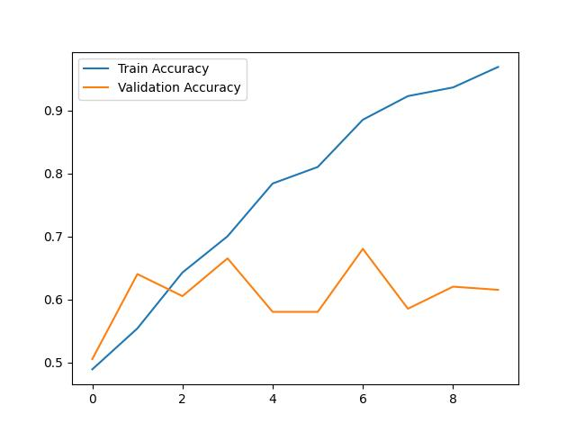

# Image Classification with TensorFlow

## 📌 Overview
This project is a simple image classification model using TensorFlow and Keras.

## 🛠 Tech Stack
- Python
- TensorFlow / Keras
- VS Code

## 📂 Dataset Structure
data/
  train/
    class1/
    class2/
  validation/
    class1/
    class2/

## 📊 Results

The model achieved good accuracy on the Cats vs Dogs dataset.

## ▶️ Run
```bash
python main.py

